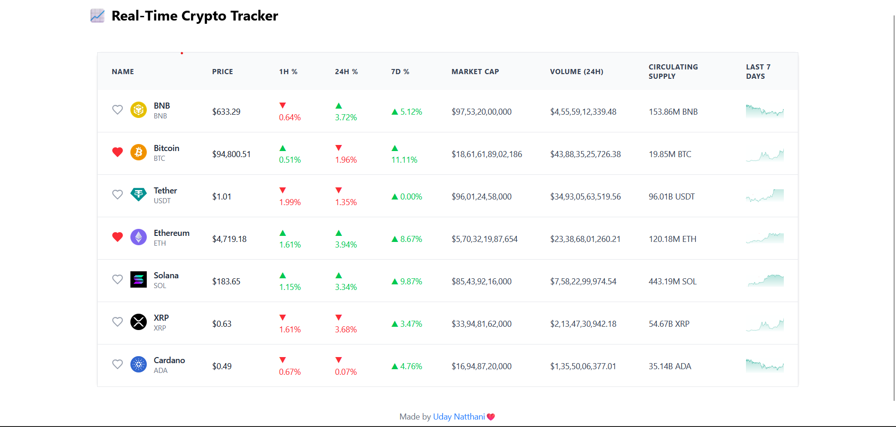

Crypto Tracker

Crypto Tracker is a responsive, real-time cryptocurrency price tracking app built using React and Redux Toolkit. Inspired by CoinMarketCap, it displays live updates of popular cryptocurrencies with a dynamic interface and support for saving favorite coins using localStorage.
Features

    Live tracking of 5 cryptocurrencies: BTC, ETH, USDT, BNB, and SOL

    Real-time simulation of price and volume updates using setInterval

    Color-coded percentage changes (green for gains, red for losses)

    Global state management using Redux Toolkit

    Favorite coins are saved locally and persist between sessions

    Fully responsive table layout for desktop and mobile

    Static 7-day chart for each coin (extendable to dynamic charts)

Tech Stack

    Frontend: React, Tailwind CSS

    State Management: Redux Toolkit

    Routing: React Router (optional)

    Icons: Lucide React

    Data Source: Sample JSON with simulated updates

    Persistence: localStorage for storing favorites

How It Works
Real-Time Simulation

The startCryptoUpdater function simulates live data updates using setInterval, refreshing every 1–2 seconds. The updates include:

    Current price

    Percentage changes (1 hour, 24 hours, 7 days)

    24-hour trading volume

Redux State Management

The cryptoSlice.js file manages the application's global state, including coin data and updates.

    The updateAsset action updates coin information in the store

    Selectors are used to minimize unnecessary re-renders

Favorites Feature

Users can mark coins as favorites by clicking the heart icon. These preferences are saved to localStorage and persist across sessions.

Demo Video/GIF:
- 2–5 min walkthrough showing:
  - UI layout
  - Live updates
  - State flow

Folder Structure

src/
│
├── assets/            
├── components/        
│   ├── CryptoTable.jsx
│   ├── CryptoRow.jsx
│   └── PercentageChange.jsx
│
├── features/
│   └── crypto/
│       ├── cryptoSlice.js
│       └── sampleData.js
│
├── utils/
│   └── cryptoUpdater.js
│
├── App.jsx
└── main.jsx

Author

Made with care by [Uday Natthani]
GitHub: https://github.com/udaynatthani